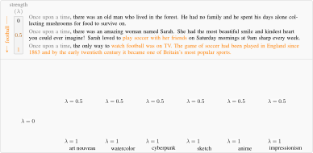

# Controlling Language and Diffusion Models by Transporting Activations
*Pau Rodriguez, Arno Blaas, Michal Klein, Luca Zappella, Nicholas Apostoloff, Marco Cuturi and Xavier Suau*


This software project accompanies the research paper: [Controlling Language and Diffusion Models by Transporting Activations](https://arxiv.org/abs/2410.23054v1) ([bibtex](#Cite)).

<a href="https://arxiv.org/abs/2410.23054v1" target="_blank">
    
</a>

---

## Setup

1. Clone the Repository:

    ```bash
    git clone https://github.com/apple/ml-act
    cd ml-act
    ```

2. Install dependencies
    
    ```bash
    pip install -r requirements.txt
    ```

3. Download datasets and models. For ease of explanation, we will use the following environment variables to point to where the datasets and models are stored: `DATA_DIR` and `CACHE_DIR`. Also, set `HF_TOKEN` if needed.

    ```bash
    export DATA_DIR="some/path"
    export CACHE_DIR="some/other/path"
    export HF_HUB_CACHE="another/path"  # optionally, models will be saved here
    export HF_TOKEN="your_token"  # required for some specific models like Gemma-2
    ```

    Then just call `python -m act.scripts.download_external_data` to download external assets to your local `$DATA_DIR`. This will download RTP prompts, the Jigsaw toxicity dataset and the COCO captions dataset. Note that models will be downloaded automatically with huggingface. Note you can setup `HF_HUB_CACHE` to point to a specific folder (see huggingface documentation).


4. Optionally, run the provided tests to make sure the setup is correct. It will download some small model from Huggingface during the first run.

    ```bash
    pytest . -m "not slow"
    ```
    
---

## Documentation

This repository contains the code for a research paper focusing on controlling model behavior through learned interventions. We provide a  pipeline script that enables users to:

1. **Extract Activations**: Obtain activations from specified model layers.
2. **Learn Interventions**: Utilize extracted activations to learn interventions that control model behavior.
3. **Evaluate Intervened Models**: Assess the performance of intervened models on various tasks.

Quick summary of the main files in the repository:

* **Python Scripts:**
	+ `pipeline.py`: Main pipeline for incremental learning of model interventions.
	+ `learn_intervention.py`: Core functionality for learning interventions from model activations.
* **[Hydra](https://hydra.cc/docs/intro/) Configuration Files (`configs` directory):**
	+ `text_generation.yaml` and `text_to_image_generation.yaml`: Primary config files, specifying:
		- Model architecture and layers
		- Task parameters (e.g., dataset, batch size)
		- Intervention type and settings (e.g., `linear_ot`)
		- Evaluation tasks (e.g., RTP, zero-shot evaluation)
	+ **Referenced Sub-Configs:**
		- `task_params/giraffes.yaml` (task-specific settings)
		- `model/gpt2.yaml` (model architecture details)
		- `intervention_params/linear_ot` (intervention-type specific settings; not explicitly listed, implied as part of the config structure)
		- `wandb/act.yaml` (WandB logging configuration)

> The `linear_ot` intervention in this repository implements `Linear-AcT` as defined in our paper: [Controlling Language and Diffusion Models by Transporting Activations](https://arxiv.org/abs/2410.23054v1)

### Running the pipeline for text generation

```bash
# see act/configs/text_generation.yaml for configuration details
python -m act.scripts.pipeline \
"task_params=giraffes" \
"responses.batch_size=20" \
"responses.max_batches=1" \
"wandb.mode=disabled" \
"text_generation.num_sentences=10" \
"text_generation.new_seq_len=48" \
"text_generation.strength_sample_size=3" \
"intervention_params.incremental=atonce" \
"device=cpu" \
"model.dtype=float32"
```

This command will:
1. Extract activations from a pre-trained `Gemma-2-2b` model as specified in `configs/text_generation.yaml`. We collect 1 batch of size 20 since we provide 20 sentences in `data/giraffes.json`). Remember to change to `device=mps` if working on MacOS and to `device=cuda` if you work on GPU for better speed.
2. Use the responses to learn an intervention. We set `intervention_params.incremental=atonce` to make this example faster, but better performance is achieved with `incr`.
3. Generate text with the intervened model. We ask to generate 10 sentences (`text_generation.num_sentences=10`) at 3 different strengths (`text_generation.strength_sample_size=3`) between 0 and 1 (so 0.0, 0.5, 1.0). 
4. Evaluate the generated text (see `evaluations` in `act/configs/task_params/toxicity.yaml` and `act/configs/text_generation.yaml`)

Note that we use [Hydra](https://hydra.cc/docs/intro/) as configuration and arguments manager.

Results will be stored in `results_dir` (set in the config file or run with `results_dir=<your/results_dir/path>`). It will also upload them to `wandb` if you have [set it up](https://docs.wandb.ai/quickstart/). (more about wandb config for this project in `configs/wandb/act.yaml`). For task-specific evaluations (e.g., `rtp`, `text_generation`, `zero_shot`), modify the `evaluation` parameter in `text_generation.yaml` or `text_to_image_generation.yaml` or [override it](https://hydra.cc/docs/advanced/override_grammar/basic/) via the command line, and re-run the pipeline.

### Running the pipeline for diffusion

```bash
python -m act.scripts.pipeline \
    --config-name text_to_image_generation \
    "task_params=coco_styles" \
    "task_params.src_subsets=['none']" \
    "task_params.dst_subsets=['art_nouveau']" \
    "task_params.prompt_subset=['none']" \
    "responses.batch_size=8" \
    "responses.max_batches=64" \
    "interventions.max_batches=null" \
    "wandb.mode=disabled" \
    "evaluation=['text-to-image-generation']" \
    "text_to_image_generation.batch_size=1" \
    "text_to_image_generation.max_batches=1" \
    "text_to_image_generation.create_gif=true" \
    "device=cuda"
```

Line by line:

1. `--config-name text_to_image_generation` chooses the config file in `configs/text_to_image_generation.yaml`.
2. `"task_params=coco_styles"` chooses the task `coco_styles` in `configs/task_params`
3. `"task_params.src_subsets=['none']"` and `"task_params.dst_subsets=['art_nouveau']"` choose the source and destination datasets respectively.
4. `"task_params.prompt_subset=['none']"` chooses the prompt dataset for inference time
5. `"responses.batch_size=8"` and `"responses.max_batches=64"` extract 8 responses per batch and run 64 batches. (512 samples). We used 32 x 64 in the paper.
6. `"interventions.max_batches=null"` will use all extrated responses to learn an intervention
7. `"evaluation=['text-to-image-generation']"` after the intervention, it will generate images. You can also add `clip_score` here. 
7. `"text_to_image_generation.create_gif=true"` this will save gif animations with the generated images at different strengths. The strengths used are configured in  `configs/text_to_image_generation.yaml` under `text_to_image_generation` with `min_strength`, `max_strength` and `strength_steps` (actual strengths will be a `np.linspace(min_strength, max_strength, strength_steps)`).

Results will be stored in `results_dir` (set in the config file or run with `results_dir=<your/results_dir/path>`). It will also upload them to `wandb` if you have [set it up](https://docs.wandb.ai/quickstart/). (more about wandb config for this project in `configs/wandb/act.yaml`). In `results_dir/generate_with_hooks_diffusion/` you will find the generated images, with a folder for each strength value and guidance scale set up in `text_to_image_generation.yaml` in the format `{strength:.03f}_{guidance:.03f}/<image_id>.png`.

---

## Customizing Hydra Configuration (e.g. `text_generation.yaml`)

### Overview of Configurable Sections

*   **Model**: Specify model architecture, path, and layer names for intervention.
*   **Task Params**: Define task-specific settings (e.g., dataset, batch size).
*   **Intervention Params**: Configure intervention type, incremental mode, and hook parameters.
*   **Evaluation**: Choose evaluation tasks to run after learning interventions.

### Example Customizations

1. **(preferred)** Override Config Values via Command Line:
    *   Use `key=value` pairs, for example:

    ```bash
    python -m act.scripts.pipeline \
        --config-name text_generation \
        interventions.intervention_params.name=your_new_intervention \
        evaluation=[rtp, zero_shot]
    ```
    *   This approach allows for quick testing of different configurations without modifying the YAML file.

2.  Change where the intervention is performed:

    The easiest way is to override arguments via commandline `model.module_names=['.*layernorm.*]`. Another option is to directly modify the config file, e.g,
    
    ```yaml
    model:
      model_path: "path/to/your/model"
      module_names:
        - layer1_regex
        - layer2_regex
    ```

    or modify/add a new model in `configs/model` and reference it in `text_generation.yaml` or `text_to_image_generation.yaml`.

3.  Switch to a Different Intervention:
    ```yaml
    interventions:
      intervention_params:
        name: your_intervention_name
        # Update hook_params if necessary for the new intervention
        hook_params:
          key: value
    ```

4.  Modify Evaluation Tasks:
    ```yaml
    evaluation:
      - rtp
      - zero_shot
      # Add or remove tasks as needed
    ```

---

## Cite
```bibtex
@article{rodriguez2024controlling,
  title={Controlling Language and Diffusion Models by Transporting Activations},
  author={Rodriguez, Pau and Blaas, Arno and Klein, Michal and Zappella, Luca and Apostoloff, Nicholas and Cuturi, Marco and Suau, Xavier},
  journal={arXiv preprint arXiv:2410.23054},
  year={2024}
}
```
